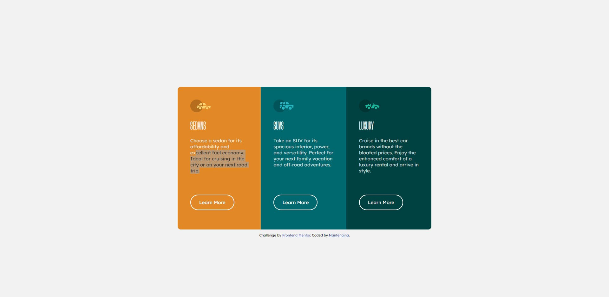

# Frontend Mentor - 3-column preview card component solution

This is a solution to the [3-column preview card component challenge on Frontend Mentor](https://www.frontendmentor.io/challenges/3column-preview-card-component-pH92eAR2-). Frontend Mentor challenges help you improve your coding skills by building realistic projects. 

### Screenshot

### Built with

- Semantic HTML5 markup
- CSS custom properties
- Flexbox

## Author

- Website - [Nantenaina](https://nathanwalker28.github.io/)
- Frontend Mentor - [@Nantenaina](https://https://www.frontendmentor.io/profile/Nathanwalker28)
